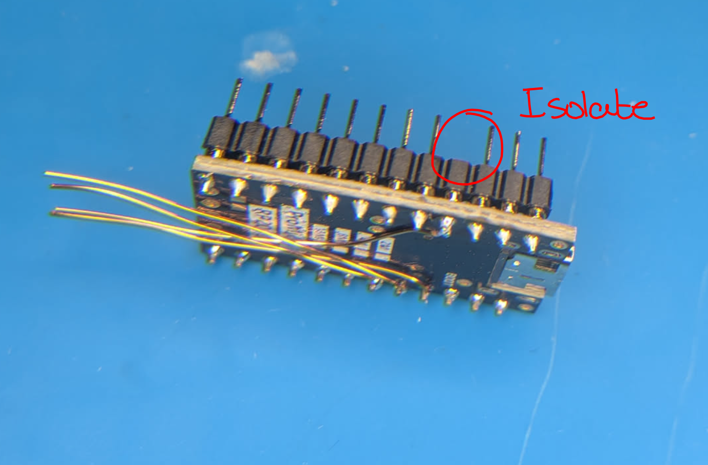
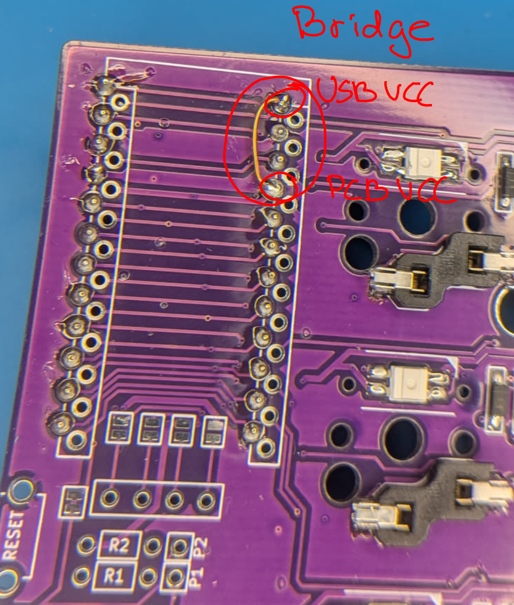
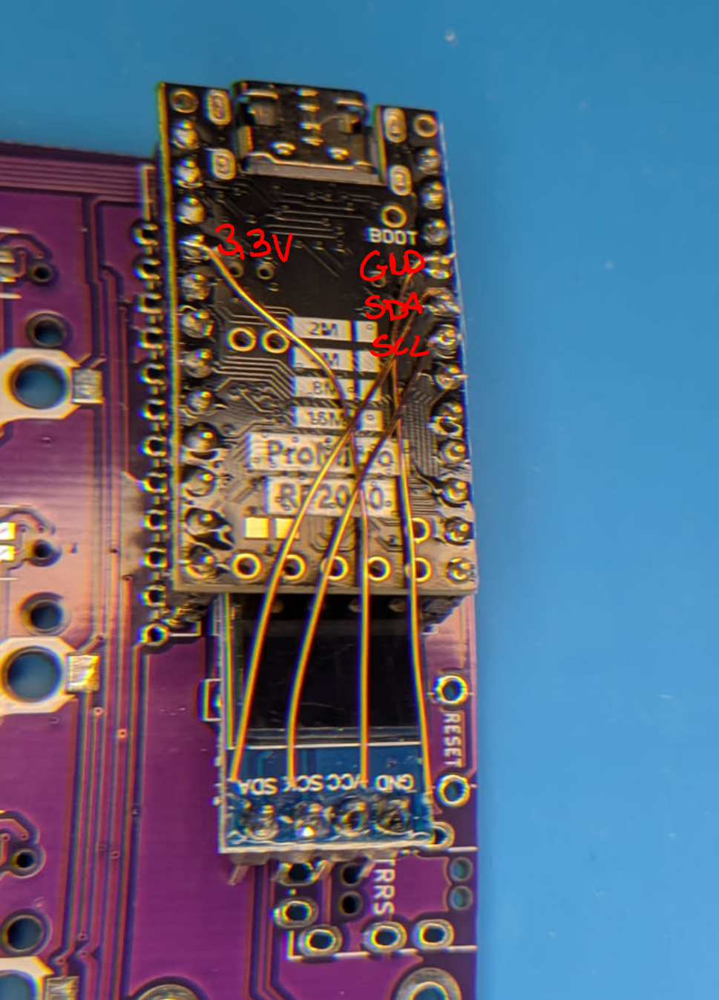
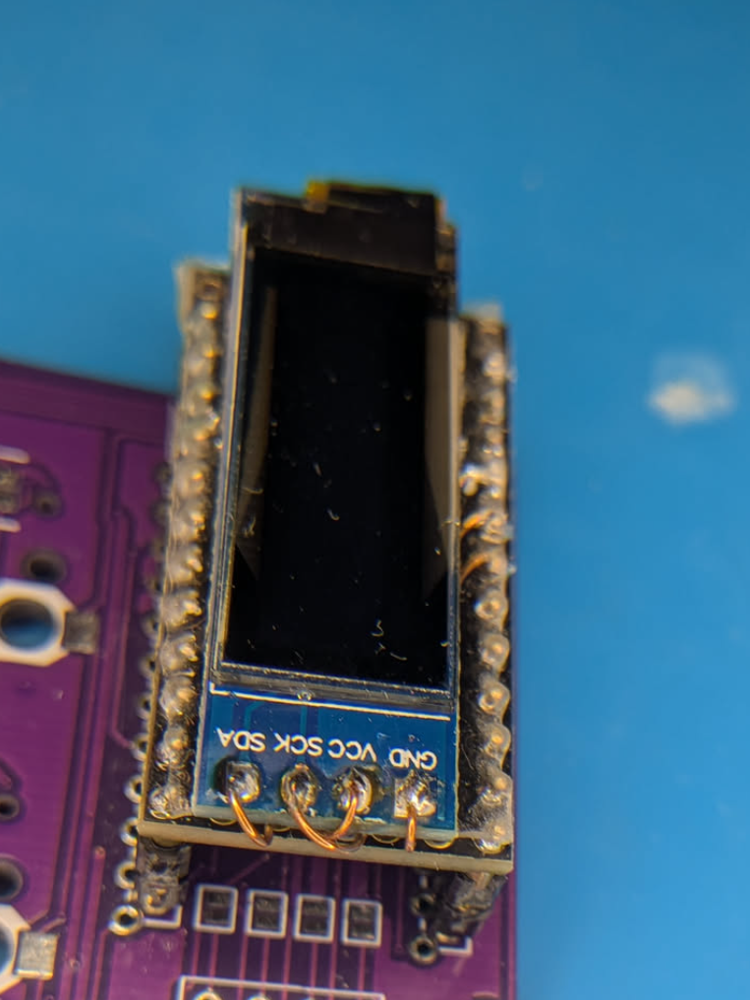

# WIP Sofle Choc RP2040 Mod

Firmware for the [Sofle Choc v2.1](https://github.com/josefadamcik/SofleKeyboard/tree/master/Sofle_Choc) by Brian Low and hardware mods for RP2040 compatibility. 

* Keyboard Maintainer: [Paul Rogalinski-Pinter](https://github.com/pulsar256/sofle_choc_rp2040)
* Hardware Supported:
  * [Sofle Choc v2.1](https://github.com/josefadamcik/SofleKeyboard/tree/master/Sofle_Choc)
  * [ProMicro RP2040](https://de.aliexpress.com/item/1005006599393967.html)

Make example for this keyboard (after setting up your build environment):

    make sofle_choc_rp2040:default

Flashing example for this keyboard:

    make sofle_choc_rp2040:default:flash

See the [build environment setup](https://docs.qmk.fm/#/getting_started_build_tools) and the [make instructions](https://docs.qmk.fm/#/getting_started_make_guide) for more information. Brand new to QMK? Start with our [Complete Newbs Guide](https://docs.qmk.fm/#/newbs).

## Bootloader

Enter the bootloader in 3 ways:

* **Bootmagic reset**: Hold down the key at (0,0) in the matrix (usually the top left key or Escape) and plug in the keyboard
* **Physical reset button**: Briefly press the button on the back of the PCB - some may have pads you must short instead
* **Keycode in layout**: Press the key mapped to `QK_BOOT` if it is available

## Required Hardware Modifications

The ProMicro RP2040 is a 3.3V system while the AVR ProMicro which is used in the PCB Design is a 5V Board. In the PCB design the RGB LED power is fed from the microcontroller board. In this modification we are going to reroute USB 5V to the RGB LED VCC Rail and also to power the split MCU via TRS, isolate the microcontroller breakout board's 3.3V rail from the PCB and hook up the OLED directly to the back of the mcu breakout board.

